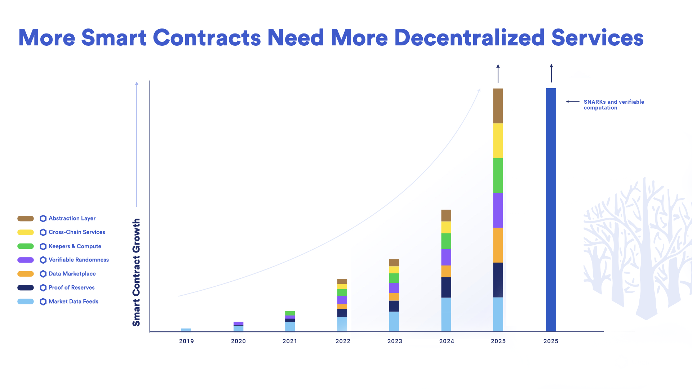
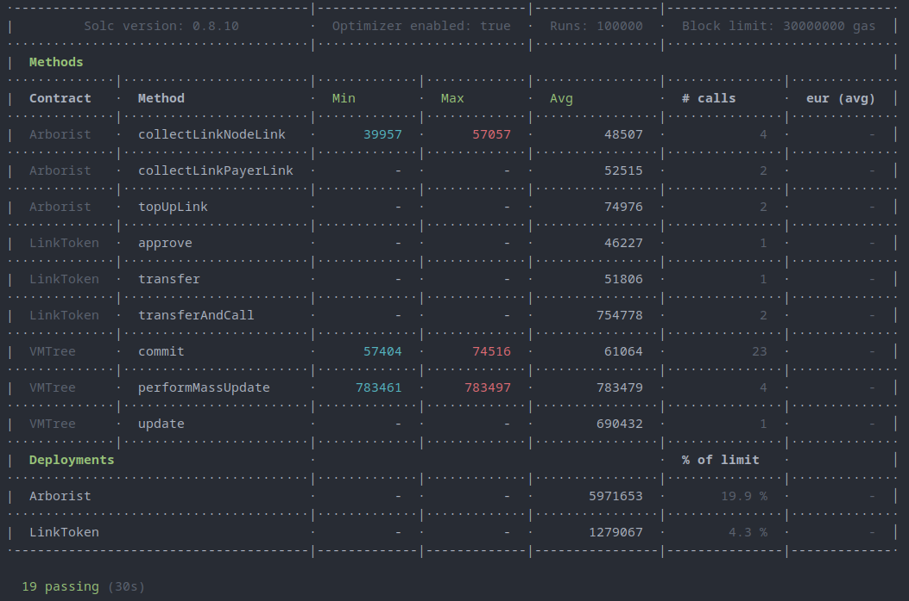

# VMTree Solidity


This is an improvement project of the initial [Verifiable Merkle Tree](https://github.com/Nobody-Labs/twister-vmt). These contracts will go on to form the backbone of an upcoming [FRAX](https://frax.finance/) stablecoin mixer, [Twister Cash](https://twistercash.xyz/).

This repository is the testing environment for the evm implementation of VMTree, and it contains all of the changes that we required to connect it to our own network of custom Chainlink nodes.

The whole point of this project is to reduce costs of depositing into a token mixer. Although this project doesn't yet accurately reflect the gas costs of a mixer, because we require a VMTree consuming contract for the privacy bit, we can see that the cost of submitting a commitment is on average only 60k gas.

I think it would be realistic to say that users will likely experience closer to 100k gas to use a full blown mixer with the VMTree, but that's in contrast to nearly 1 million gas not using a VMTree.

The user actually never pays for the updates directly, because the protocol covers the cost of LINK tokens to pay the chainlink nodes. In practice, Twister will autonomously allocate funds towards the LINK tokens to subsidize tree updates by charging fees on withdrawals. Even with a part of the withdrawal fee being derived from the deposit gas, it will be a net-gain for users, but that will require accurate pricing strategy derived from the real cost of computing insertions and the real cost of running nodes. Speaking realistically, we may in practice achieve a real savings of only 2x instead of 10x. I'm sure after a certain number of nodes it becomes unsustainable economically, but I don't know that limit.

If we have foreknowledge of the total number of nodes we'll be using, and we know an average cost of operating each node, then we can add that cost to the gas cost of performing updates, then we can derive an average cost on a per commitment basis, and we can charge exactly that for each commitment to the protocol in the form of LINK tokens. We can make the amount of LINK tokens required for an update track a LINK/USD price feed in real-time. Or maybe it would be more appropriate to use a LINK/FRAX price feed. So our oracle network could end up driving revenue to the existing oracle network.

The protocol can have a system-wide, non-predatory withdrawal fee that's decided in such a manner that it must at least meet the minimum required value to sustain the operation of the VMTrees via LINK buybacks. As far as I know, it would be the first on-chain business that is designed to direct fees to a verifiable computation layer using profits from a separate service, namely privacy.

Not only that, but the protocol will earn interest on deposits by deploying the capital into lending platforms (Aave, Fuse, Fraxlend, Comp, etc.) as well as by deploying capital in flash loans (TwisterFlashPool). So I think the system will have enough profits to pay for the verifiable computation layer, meaning users will actually get the **cheapest costs possible.** The end user will experience a direct 10x gas cost reduction, while the protocol is a sustainable on-chain business that improves the quality of people's lives by giving them financial privacy tools.

I can think of many ways to further optimize this entire thing. There is still much work to be done if the verifiable computation flippening is going to happen in 2025.



# Install
Clone the repo.
```bash
$ git clone https://github.com/vmtree/solidity.git vmtree-solidity
$ cd vmtree-solidity
```

Download the zero knowledge proving and verifiying keys and circuits. These are the same that the adapter uses.
```bash
$ ./scripts/get_zk_keys.sh
```

Install via yarn or npm.
```bash
$ yarn
```

# Tests
Run the tests using the hardhat command.
```bash
$ npx hardhat test
```
You should see a see of green arrows and a printout of the gas report at the end.



# Contracts
In general, I tried to make the contracts as gas optimized as possible. There's only Solidity contracts in this repo, though, so sorry to all the Yul and EVM asm nerds out there. There's two main contracts: Arborist and VMTree. I also included the Chainlink token contract for local testing.

## Arborist.sol
The Arborist is the caretaker of verifiable merkle trees. He is a custom Chainlink oracle contract that requires LINK tokens in order to deploy new VMTrees. The Chainlink nodes listen to him for instructions when to update the tree. He gives them the current state of the tree, then when the Chainlink nodes have verifiably computed the next state of the tree, he pays them for their service by incrementing their LINK balance and decrementing the LINK balance of the VMTree's paying account.

The Arborist has a design that closely resembles [Chainlink Keepers](https://keepers.chain.link/). With Keepers, nodes follow a pattern of retrieving data from a `checkUpkeep` function, then writing the result in a `performUpkeep` function.

This is the same but with a twist, we use a `checkMassUpdate` function, but then we use a custom chainlink external adapter that does a verifiable computation using SNARKs, then we write the result plus a proof that the result is true in a `performMassUpdate` function.

There's another difference from keepers that's worth noting. In keepers, nodes check for a trigger condition every block by simulating each `checkUpkeep` call that they have in their repertoire of off-chain computation jobs to perform.

Whenever a VMTree is ready to update, it signals to the Arborist, and he emits the `OracleRequest` event. So the Chainlink node only simulates the `checkMassUpdate` call whenever the condition is already true. However, this means one user has to pay around 18k gas more than the others to trigger the event. So maybe we can wait for a whale to deposit every 10th commitment.

```solidity
event OracleRequest(
    bytes32 indexed specId,
    address requester,
    bytes32 requestId,
    uint256 payment,
    address callbackAddr,
    bytes4 callbackFunctionId,
    uint256 cancelExpiration,
    uint256 dataVersion,
    bytes data
);
```
This blockchain event alerts the Chainlink nodes that are listening to events in every block. They are waiting for an `OracleRequest` event with `specId = 0x0badc0de0badc0de0badc0de0badc0de00000000000000000000000000000000` originating from the Arborist contract's address. They will call `requester`/`callbackAddr`  with the `callbackFunctionId` as its data, which is the function selector for `checkMassUpdate`. The data that they retrieve from the call will be fed to the external adapter, then the Chainlink node will call `requester` again but this time with data for the `performMassUpdate` function: the new merkle tree state and a zero knowledge proof that it's cryptographically true. The VMTree contract will finally hook back into the Arborist to pay the link node for their humble service. I think this design minimizes the overhead of payment accounting.

In the future, it will only be one node's turn to respond, and there will be some kind of ordering algorithm for the nodes in a queue of chainlink oracles. I think we can use staking to allow nodes to join the queue, but it depends on a lot of things. For the initial testnet versions, this will just be gated by my own EOA address.

## VMTree.sol
This is the verifiable merkle tree itself. When we deploy a new VMTree, we give it a `controller` address. In practice, the `controller` should be a smart contract that collects tokens and commitments, then uses the merkle root stored in the VMTree for withdrawals using a privacy SNARK. Twister will have a contract that does this during the deployment step of new mixer pools.

In this test, though, it's simply an EOA address so there isn't an actual usecase attached to the VMTree in this design, unless we wanted to do off-chain proofs using commitments from this tree. It would actually be pretty interesting to make a zk version of snapshot using custom proofs with the commitments from a VMTree, but that's a battle for another day.

The VMTree contract maintains a list of `filledSubtrees`. These nodes represent the state of the tree. They can only be updated with a valid SNARK. The SNARK proves that the resulting state was generating using the correct computation, in other words it proves that the result is true. When the oracle updates the tree, it submits two arrays: `proof`, and `newFilledSubtrees`. The `MassUpdateVerifier` contract verifies the proof, then saves the new state in the contract.

I left the circuits in the previous contract, and instructions how to generate the proving and verifying keys there as well. See the [circuits](https://github.com/Nobody-Labs/twister-vmt/tree/main/circuits) in the other repository. The verifiable computation is done using a library I refined during this hackathon: [vmt-js](https://github.com/Nobody-Labs/vmt-js), The adapter also uses this dependency.. If you snoop around in this repo you'll see that I already added the off-chain computation code for using poseidon hash instead of MiMC. However, I haven't made the poseidon circuits yet!


## LinkToken.sol
The Chainlink token contract supports the ERC677 standard, so that means it has a special function called `transferAndCall`.
```solidity
/**
* @dev transfer token to a contract address with additional data if the recipient is a contact.
* @param _to The address to transfer to.
* @param _value The amount to be transferred.
* @param _data The extra data to be passed to the receiving contract.
*/
function transferAndCall(address _to, uint _value, bytes _data)
    public
    returns (bool success)
{
    super.transfer(_to, _value);
    Transfer(msg.sender, _to, _value, _data);
    if (isContract(_to)) {
        contractFallback(_to, _value, _data);
    }
    return true;
}
```
ERC677 tokens can only send data to contracts that implement the `ERC677Receiver` interface.
```solidity
contract ERC677Receiver {
    function onTokenTransfer(address _sender, uint _value, bytes _data);
}
```

In effect, this means we can program our own contracts to go through the Chainlink token contract if we implement our own logic for this interface. The Arborist does this to deploy new VMTrees. The only way to deploy a new VMTree is to pay the Arborist using `transferAndCall`.